# E2E 自我測試執行報告

- 執行時間：2026-10-10T02:05:57.715Z
- 版本：桌面版 v3.25.1（Web 核心 v3.15.1）
- 環境：本地沙箱（headless Chromium + mock Tauri plugin + 真 SQLite node:sqlite）
- 用例總數：38；PASS 38；FAIL 0
- 總耗時：146.6s

## 用例結果總表

| # | 用例 | 結果 | 耗時 |
|---|------|------|------|
| P0 | 前置：FY2026 存在＋匯入 6 科目 | PASS | 2013ms |
| A1 | 正常銷貨 voucher（借貸平衡＋三簽名） | PASS | 6453ms |
| A2 | 借貸不平被擋（Dr 100／Cr 90） | PASS | 1999ms |
| A3 | 無效科目被擋 | PASS | 1006ms |
| A4 | 日期唔喺財年內被擋 | PASS | 1005ms |
| A5 | 欠簽名被擋 | PASS | 1006ms |
| B1 | 修改金額並重過賬 | PASS | 4893ms |
| B2 | 修改後試算表仍平衡 | PASS | 0ms |
| B3 | 修改科目觸發報表重分類 | PASS | 6328ms |
| B4 | （觀察）桌面版 voucher 刪除功能 | PASS | 15ms |
| C1 | 兩張銷貨發票入賬（INV001／INV002） | PASS | 10134ms |
| C2 | 收款唔指定發票 → FIFO 對銷最舊 | PASS | 6819ms |
| C3 | AR 賬齡餘額（INV001 餘 2,000／INV002 餘 5,000） | PASS | 1812ms |
| C4 | 收款指定發票 INV002 | PASS | 6827ms |
| C5 | AR 總額勾稽 | PASS | 0ms |
| E1 | 試算表生成 | PASS | 1306ms |
| E2 | 損益表生成 | PASS | 1291ms |
| E3 | 資產負債表生成 | PASS | 1302ms |
| E4 | AR 賬齡生成 | PASS | 1305ms |
| E5 | AP 賬齡生成 | PASS | 1298ms |
| E6 | 採購報告生成 | PASS | 1290ms |
| E7 | 銷售報告生成 | PASS | 1304ms |
| E8 | Journal生成 | PASS | 1299ms |
| E9 | Voucher Register生成 | PASS | 1284ms |
| E10 | 報表月份篩選（2026-10 單月） | PASS | 11212ms |
| H1 | 有 Detail → Journal 逐行顯示 | PASS | 7623ms |
| H2 | 吉 Detail → Journal 用 voucher 摘要 | PASS | 7537ms |
| D1 | 新增財年 FY2027 | PASS | 1794ms |
| D2 | 新財年入賬唔影響舊年 P&L | PASS | 8367ms |
| D3 | FIFO 唔跨財年 | PASS | 8439ms |
| D4 | 財年下拉隔離 voucher 列表 | PASS | 2625ms |
| F1 | Voucher 範本有科目下拉選單 | PASS | 1854ms |
| F2 | 資料夾匯入 Excel＋附件 | PASS | 5150ms |
| F3 | JSON 備份→新庫→還原端到端 | PASS | 9348ms |
| G1 | 工具欄修改公司名 | PASS | 3274ms |
| G2 | 吉公司名被拒 | PASS | 1304ms |
| G3 | reload 後公司名仲喺度 | PASS | 4726ms |
| G4 | 報表匯出標題用公司名 | PASS | 6054ms |

## 各用例詳情

### P0 前置：FY2026 存在＋匯入 6 科目 — PASS（2013ms）

- 步驟：讀財年 → importExcelData 匯入 6 科目
- 預期：FY2026 涵蓋 2026-10；5 科目入庫
- 實際：FY=2026 accounts=6

### A1 正常銷貨 voucher（借貸平衡＋三簽名） — PASS（6453ms）

- 步驟：建立 Voucher 頁填單 → Dr AR of Toy Hunters 22,000／Cr Sales 22,000 → 三簽名 → 過賬
- 預期：過賬成功；lines 整數分 2200000；persist 落庫
- 實際：no=T100126 lines=[{"debit_cents":2200000,"credit_cents":0},{"debit_cents":0,"credit_cents":2200000}]
- 截圖：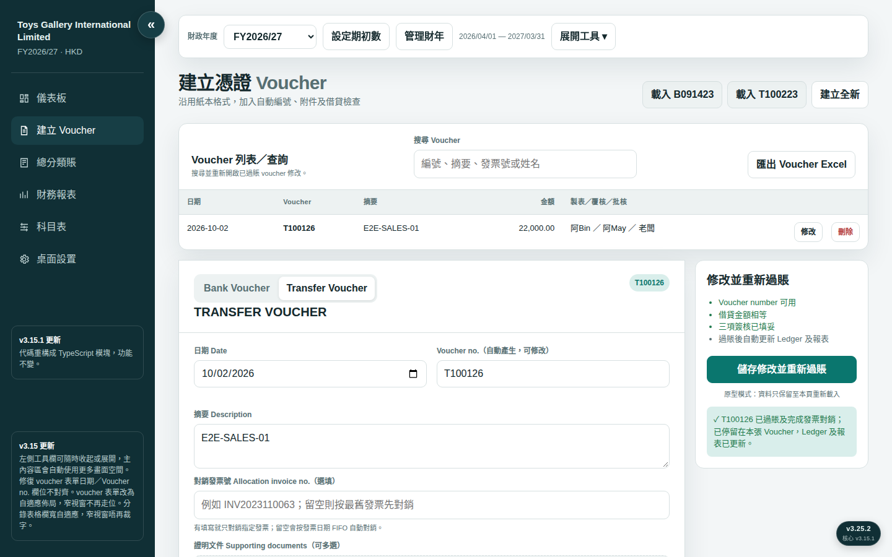

### A2 借貸不平被擋（Dr 100／Cr 90） — PASS（1999ms）

- 步驟：填 Dr 100／Cr 90 → 檢查 postBtn 狀態
- 預期：postBtn disabled；顯示差額 HK$10.00
- 實際：{"disabled":true,"balance":"差額 HK$ 10.00"}
- 截圖：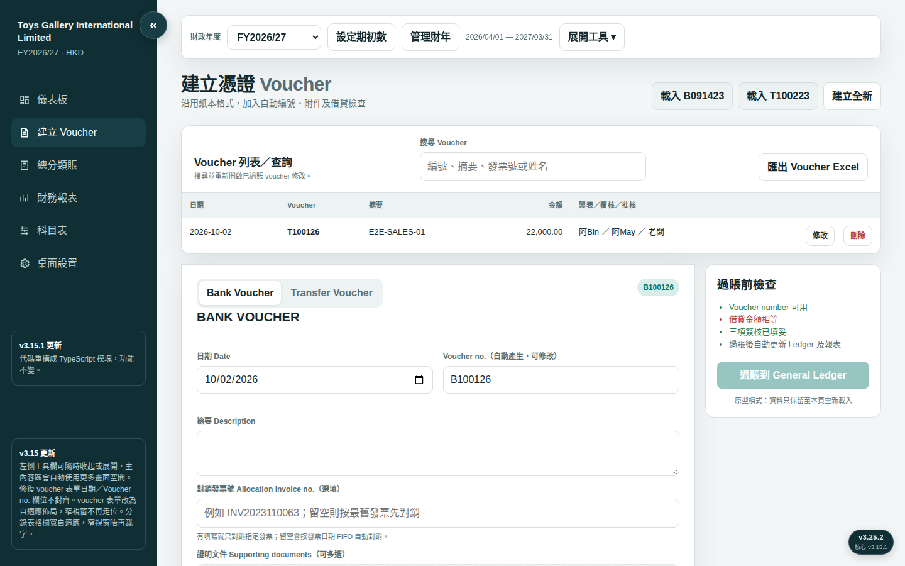

### A3 無效科目被擋 — PASS（1006ms）

- 步驟：科目填「唔存在嘅科目」 → 檢查 postBtn
- 預期：postBtn disabled；提示選有效科目
- 實際：{"disabled":true,"balance":"請從搜尋結果選擇有效會計科目"}

### A4 日期唔喺財年內被擋 — PASS（1005ms）

- 步驟：日期改 2028-05-01 → 檢查 postBtn
- 預期：postBtn disabled
- 實際：{"disabled":true}

### A5 欠簽名被擋 — PASS（1006ms）

- 步驟：清空 approvedBy → 檢查 postBtn
- 預期：postBtn disabled
- 實際：{"disabled":true}

### B1 修改金額並重過賬 — PASS（4893ms）

- 步驟：voucher 列表㩒「修改」 → 金額 22,000→20,000 → 儲存修改並重新過賬
- 預期：同一張單更新（唔會多一張）；DB 只有 1 張 voucher
- 實際：mode=儲存修改並重新過賬 count 1→1 debit=2000000
- 截圖：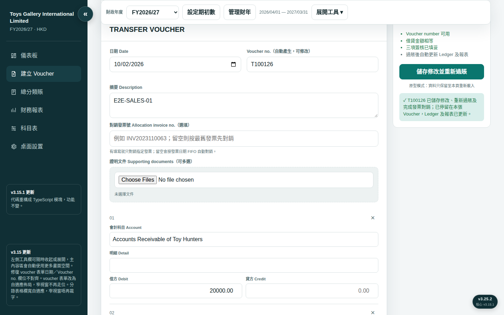

### B2 修改後試算表仍平衡 — PASS（0ms）

- 步驟：SQL：FY2026 voucher_lines Dr／Cr 總和
- 預期：Dr 總額＝Cr 總額
- 實際：Dr=2000000 Cr=2000000

### B3 修改科目觸發報表重分類 — PASS（6328ms）

- 步驟：將 Cr 科目 Sales→Other Income → 重過賬 → 睇 P&L
- 預期：P&L：Sales 消失，Other Income 20,000
- 實際：OtherIncome+20000=true \| P&L頭200字：損益表 Profit & Loss Account  Toys Gallery International Limited · HKD  下載 CSV（Excel 可開啟） 複製 CSV 內容 沿用現有 Excel 報表格式 報表月份 全年 2026年4月 2026年5月 2026年6月 2026年7月 2026年8月 2026年9月 2026年10月 2026年11月 2026年12月 2027

### B4 （觀察）桌面版 voucher 刪除功能 — PASS（15ms）

- 步驟：檢查 voucher 列表操作欄
- 預期：記錄現狀（唔修）
- 實際：操作欄只有「修改」=false → 列為 open question（可能係 audit trail 設計取捨，唔估）

### C1 兩張銷貨發票入賬（INV001／INV002） — PASS（10134ms）

- 步驟：銷貨單 2026-10-03：Dr AR 10,000／Cr Sales 10,000，AR 行明細 INV001 → 銷貨單 2026-10-05：Dr AR 5,000／Cr Sales 5,000，AR 行明細 INV002
- 預期：兩張過賬成功
- 實際：銷貨單 2/2

### C2 收款唔指定發票 → FIFO 對銷最舊 — PASS（6819ms）

- 步驟：收款單 2026-10-06：Dr Bank 8,000／Cr AR of Toy Hunters 8,000，allocationInvoice 吉
- 預期：INV001 對銷 8,000（最舊先）
- 實際：allocations=[{"invoice_no":"INV001","amount_cents":800000}]

### C3 AR 賬齡餘額（INV001 餘 2,000／INV002 餘 5,000） — PASS（1812ms）

- 步驟：reports → ar → 睇 Toy Hunters 賬齡
- 預期：INV001 餘 2,000；INV002 餘 5,000
- 實際：INV001+2000=true INV002+5000=true
- 截圖：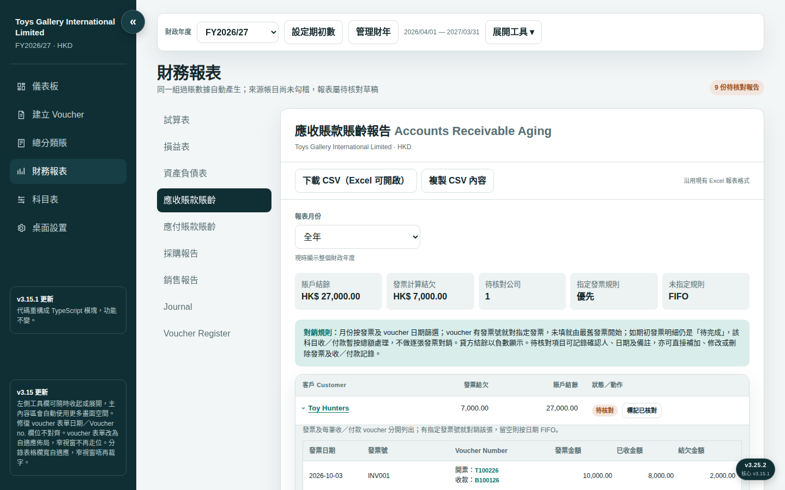

### C4 收款指定發票 INV002 — PASS（6827ms）

- 步驟：收款單 2026-10-07：Dr Bank 2,000／Cr AR 2,000，allocationInvoice=INV002
- 預期：INV002 餘 3,000；INV001 餘額不變
- 實際：allocations=[{"invoice_no":"INV002","amount_cents":200000}]

### C5 AR 總額勾稽 — PASS（0ms）

- 步驟：AR 賬齡 Toy Hunters 總餘額 vs 發票餘額之和
- 預期：2,000＋3,000＝5,000 一致
- 實際：["INV001餘200000","INV002餘300000"] 總=500000

### E1 試算表生成 — PASS（1306ms）

- 步驟：reports → trial
- 預期：Dr 總額＝Cr 總額
- 實際：長度=449 Dr=4500000 Cr=4500000
- 截圖：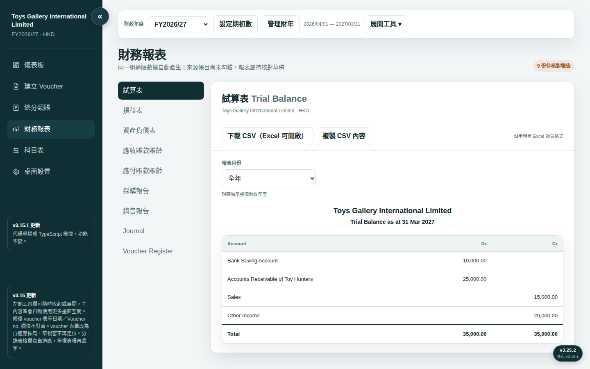

### E2 損益表生成 — PASS（1291ms）

- 步驟：reports → pl
- 預期：Sales 15,000；Other Income 20,000
- 實際：長度=659 關鍵字=true
- 截圖：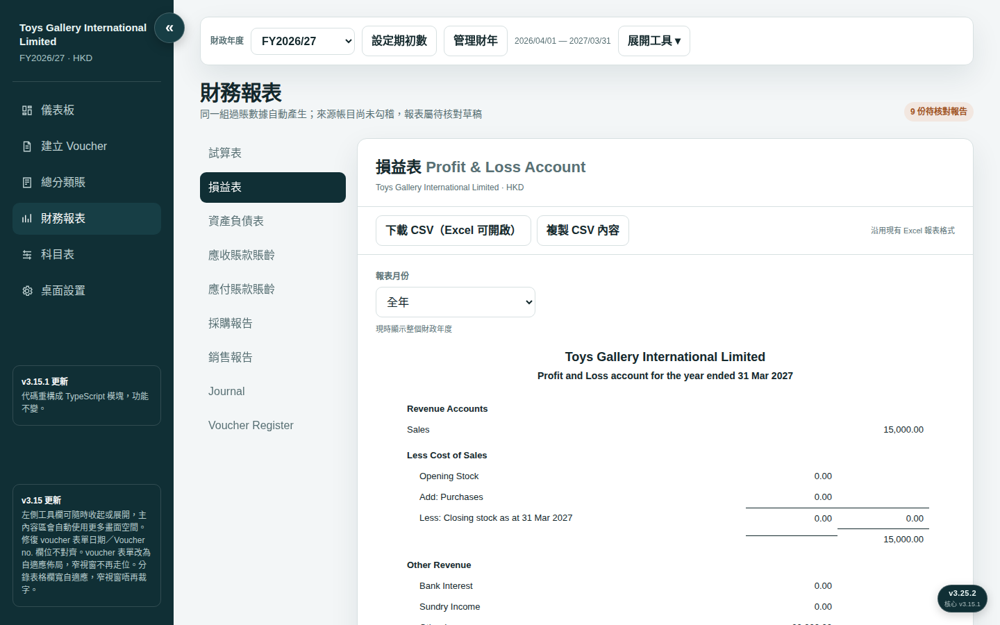

### E3 資產負債表生成 — PASS（1302ms）

- 步驟：reports → bs
- 預期：有資產／負債＋權益結構
- 實際：長度=836 關鍵字=true
- 截圖：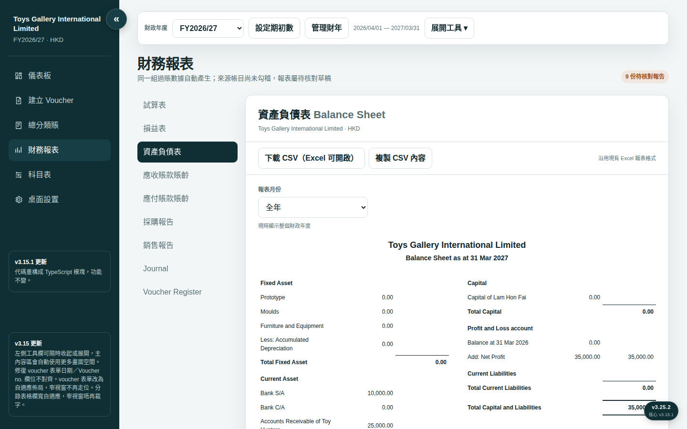

### E4 AR 賬齡生成 — PASS（1305ms）

- 步驟：reports → ar
- 預期：Toy Hunters 逐張發票餘額
- 實際：長度=551 關鍵字=true
- 截圖：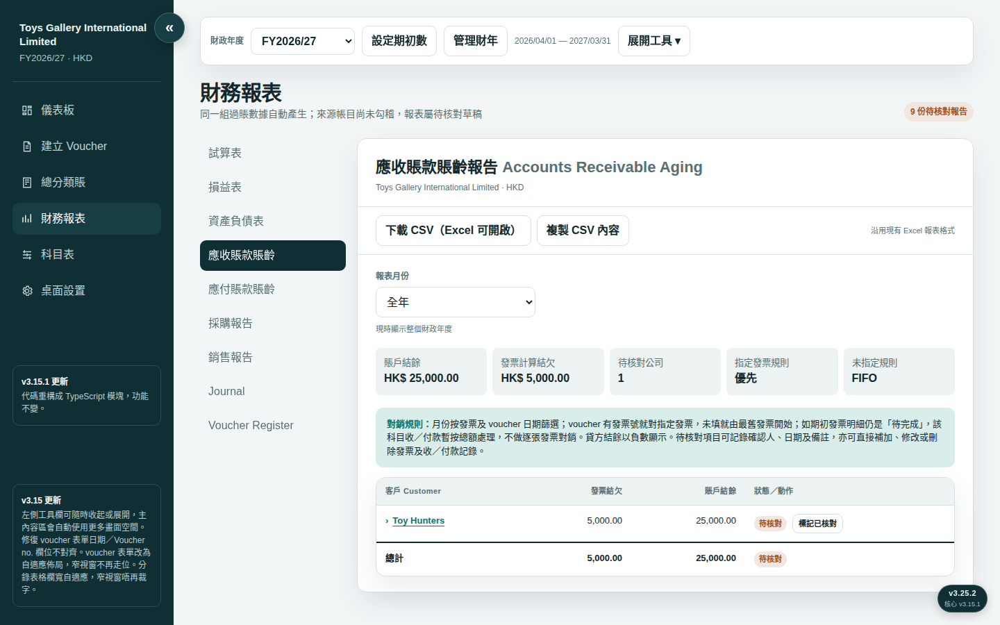

### E5 AP 賬齡生成 — PASS（1298ms）

- 步驟：reports → ap
- 預期：無數據唔報錯
- 實際：長度=459
- 截圖：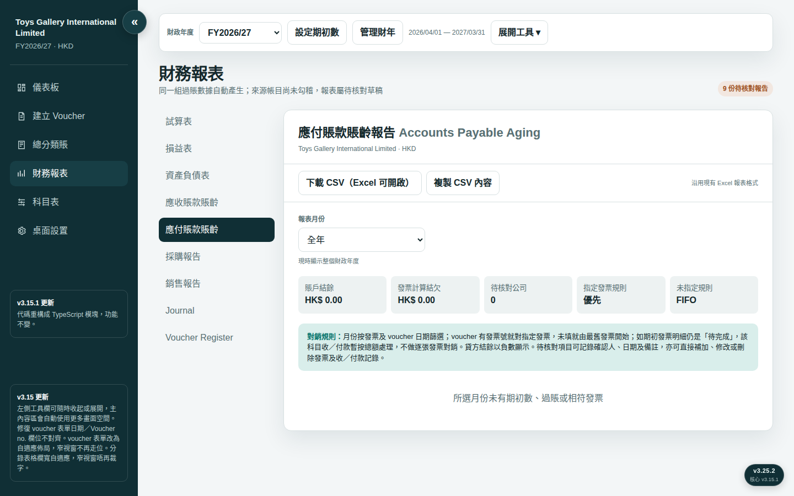

### E6 採購報告生成 — PASS（1290ms）

- 步驟：reports → purchase
- 預期：月份 tab 存在
- 實際：長度=335
- 截圖：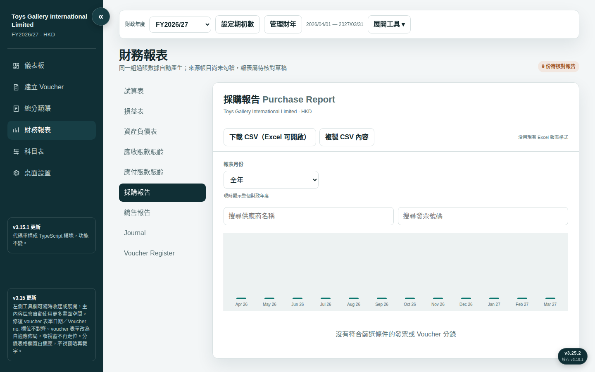

### E7 銷售報告生成 — PASS（1304ms）

- 步驟：reports → sales
- 預期：Sales 金額
- 實際：長度=1025 關鍵字=true
- 截圖：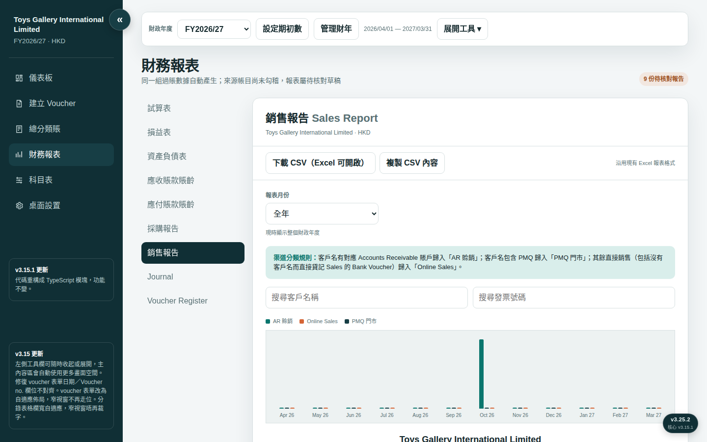

### E8 Journal生成 — PASS（1299ms）

- 步驟：reports → journal
- 預期：逐張 voucher 逐行分錄
- 實際：長度=959 關鍵字=true
- 截圖：

### E9 Voucher Register生成 — PASS（1284ms）

- 步驟：reports → register
- 預期：行數＝voucher 數
- 實際：長度=612 vouchers=5
- 截圖：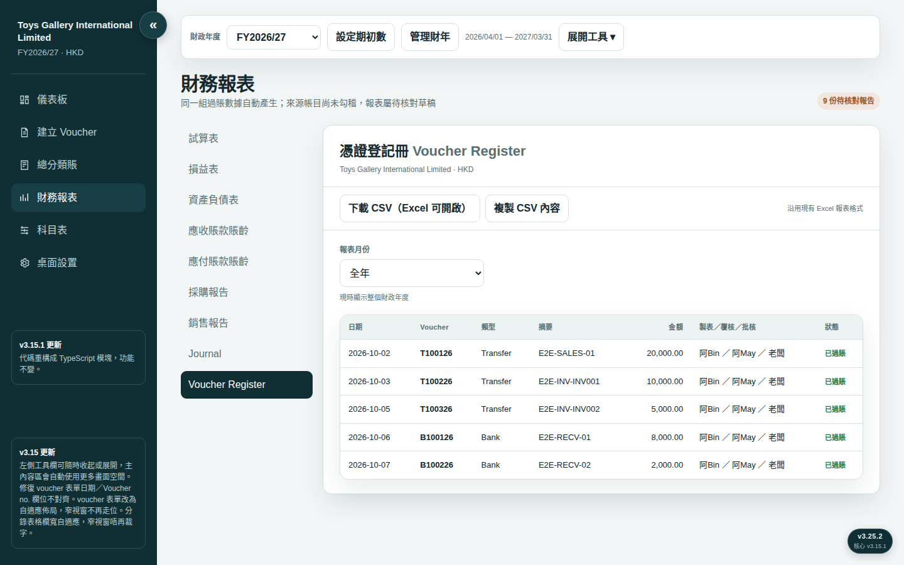

### E10 報表月份篩選（2026-10 單月） — PASS（11212ms）

- 步驟：加一張 2026-09 採購單 → P&L 切 2026-10 → 對比全年
- 預期：單月 P&L 無 9 月採購費用；全年有
- 實際：10月無Purchase=true 全年有=true

### H1 有 Detail → Journal 逐行顯示 — PASS（7623ms）

- 步驟：入單：Dr Purchase 1,000（明細「文具費」）／Cr Bank 1,000（明細「銀行扣款」） → 睇 Journal
- 預期：Journal 逐行顯示「文具費」同「銀行扣款」
- 實際：文具費=true 銀行扣款=true
- 截圖：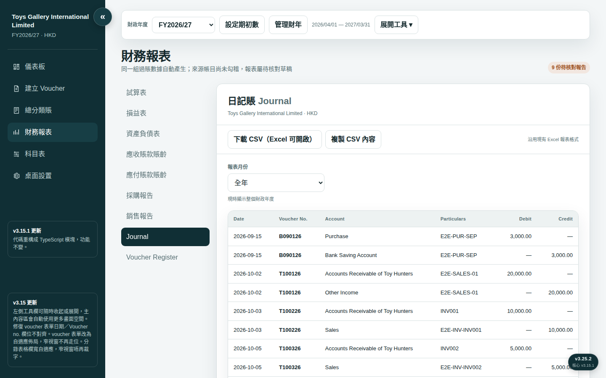

### H2 吉 Detail → Journal 用 voucher 摘要 — PASS（7537ms）

- 步驟：入單：Detail 吉晒，摘要 E2E-NODETAIL → 睇 Journal
- 預期：Journal 用摘要顯示
- 實際：摘要出現=true

### D1 新增財年 FY2027 — PASS（1794ms）

- 步驟：財年管理 → 開始年份 2027 → 新增
- 預期：FY2027 建立並自動切換
- 實際：key=2027 fys=2027,2026 msg=✓ 已新增並切換至 FY2027/28。
- 截圖：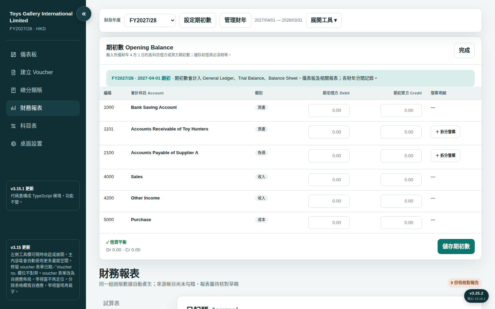

### D2 新財年入賬唔影響舊年 P&L — PASS（8367ms）

- 步驟：FY2027 入銷貨單 30,000（2027-04-05） → 切返 FY2026 睇 P&L
- 預期：FY2026 P&L Sales 維持 15,000（唔包 30,000）
- 實際：FY2026 P&L Sales=15000=true 無30000=true

### D3 FIFO 唔跨財年 — PASS（8439ms）

- 步驟：切 FY2027，收 AR of Toy Hunters 5,000（2027-04-10） → 查 FY2026 INV001／INV002 對銷額
- 預期：FY2026 兩張發票對銷額不變（8,000／2,000）
- 實際：INV001=800000 INV002=200000

### D4 財年下拉隔離 voucher 列表 — PASS（2625ms）

- 步驟：切 FY2027／FY2026，數 voucher 列表行數
- 預期：兩個財年顯示各自嘅單
- 實際：FY2027列表=2 FY2026列表=8 DB26=8

### F1 Voucher 範本有科目下拉選單 — PASS（1854ms）

- 步驟：下載 voucher 範本 → 解 xlsx 查 dataValidation
- 預期：13 欄；借／貸方欄有下拉
- 實際：範本欄數=13 dataValidation=2 科目字串=false

### F2 資料夾匯入 Excel＋附件 — PASS（5150ms）

- 步驟：資料夾放 Excel＋1 附件 → 從資料夾匯入 → 驗證入庫
- 預期：匯入成功；附件入庫且 bytes 一致
- 實際：vouchers 10→11 附件bytes一致=true
- 截圖：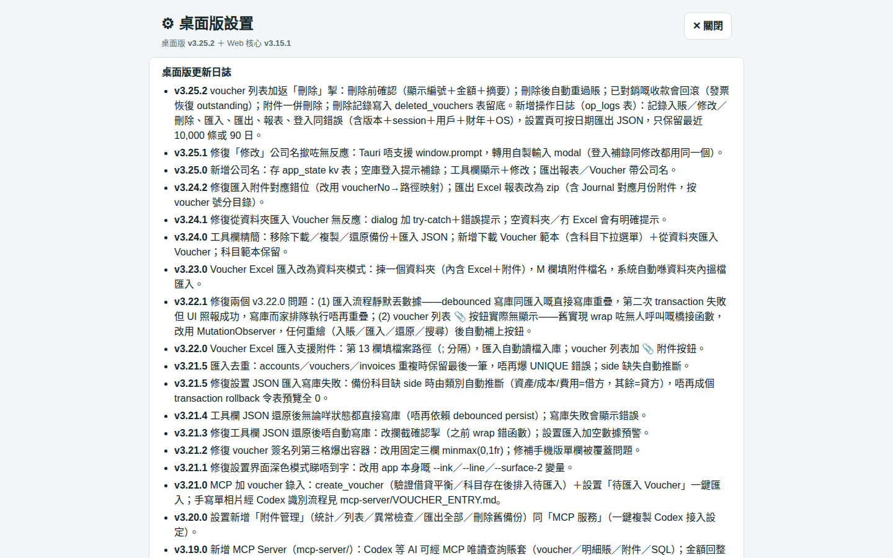

### F3 JSON 備份→新庫→還原端到端 — PASS（9348ms）

- 步驟：createBackupPayload 匯出 → 切空白新庫 → 設置頁 JSON 匯入 → 驗證數據返嚟
- 預期：voucher／科目／附件數全部一致
- 實際：voucher 11→11 科目 6→6 附件 1→1

### G1 工具欄修改公司名 — PASS（3274ms）

- 步驟：㩒「修改」→ modal 輸入「E2E 測試公司」→ 確定
- 預期：工具欄顯示「公司：E2E 測試公司」
- 實際：工具欄顯示=E2E 測試公司
- 截圖：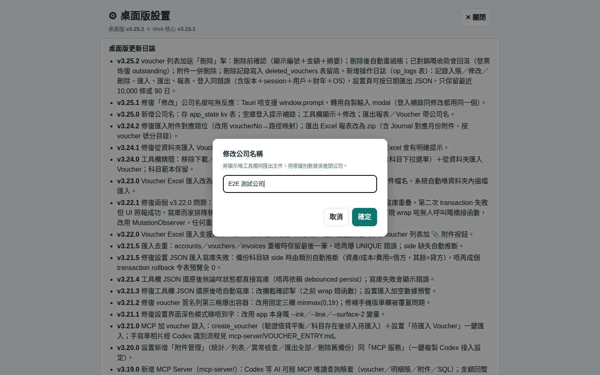

### G2 吉公司名被拒 — PASS（1304ms）

- 步驟：開 modal → 清空 → 確定
- 預期：顯示「請輸入公司名稱」；舊名保留
- 實際：err=請輸入公司名稱 仍開住=true 名=E2E 測試公司

### G3 reload 後公司名仲喺度 — PASS（4726ms）

- 步驟：reload → 檢查工具欄＋app_state
- 預期：公司名持久化
- 實際：工具欄=E2E 測試公司 DB="E2E 測試公司"

### G4 報表匯出標題用公司名 — PASS（6054ms）

- 步驟：匯出 Excel 報表 zip → 解 zip 睇 xlsx 標題
- 預期：標題含「E2E 測試公司」
- 實際：標題=E2E 測試公司 — 試算表 Trial Balance

## 自我發現問題／修復記錄

### [第 1 輪] P0 — importExcelData 後 10 秒 DB 內 accounts 仍為 0

- 根因：測試問題，非產品 bug。產品設計係事件驅動 persist（任何 click/change/input/submit → debounce 1.5s；另有 visibilitychange flush）。importExcelData 本身唔直接 call schedulePersist。測試用 __TG__ 直接調 API、零 DOM 事件，所以無觸發落庫。真實流程（設置頁撳掣匯入）一定有 click 事件，會正常落庫。
- 修法：測試腳本改為 dispatch 一次 synthetic click 再 poll DB，貼合產品設計。
- 驗證：第二輪重跑 38/38 PASS（2026-10-10），確認修復有效

### [第 1 輪] C3 — AR 賬齡 report innerText 搵唔到 INV001／INV002

- 根因：測試問題。發票明細喺 drill-down 隱藏行（tr.detail-row hidden），innerText 唔包含隱藏元素。產品設計正確（㩒開先睇明細）。
- 修法：測試改為先 click .drill-trigger 再讀 textContent。
- 驗證：第二輪重跑 38/38 PASS（2026-10-10），確認修復有效

### [第 1 輪] F1 — 範本欄數讀出 1（預期 13）

- 根因：測試問題。讀咗 SheetNames[0]（「說明」表）而唔係「範本」表。dataValidation=2 證明下拉選單本身無問題。
- 修法：測試改讀 wb.Sheets['範本']。
- 驗證：第二輪重跑 38/38 PASS（2026-10-10），確認修復有效

### [第 1 輪] F3 — 備份附件數 0→還原後 1，對唔上

- 根因：測試問題。createBackupPayload 無頂層 attachments 陣列，附件嵌喺 vouchers[].attachments。還原後 DB 有 1 個附件證明產品正確。
- 修法：測試改為由 vouchers[].attachments 計總數。
- 驗證：第二輪重跑 38/38 PASS（2026-10-10），確認修復有效

## 未覆蓋／限制

- Mac 真機原生 dialog／TCC 權限（沙箱係 Linux headless mock）。
- 深色模式等視覺細節。
- B4：桌面版無 voucher 刪除功能（open question，未修）。
- 期初數（opening balances）流程本輪未覆蓋。
